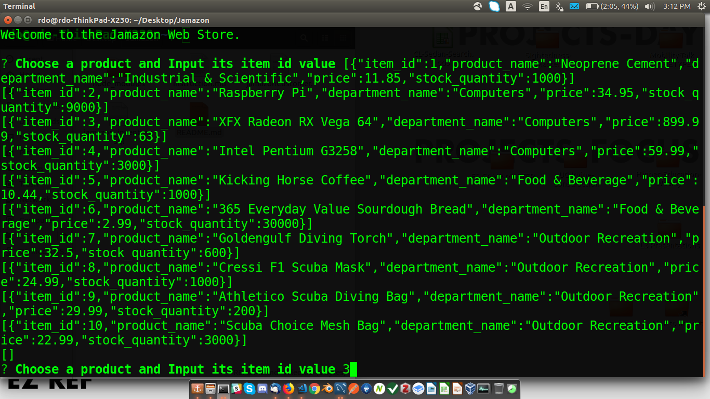
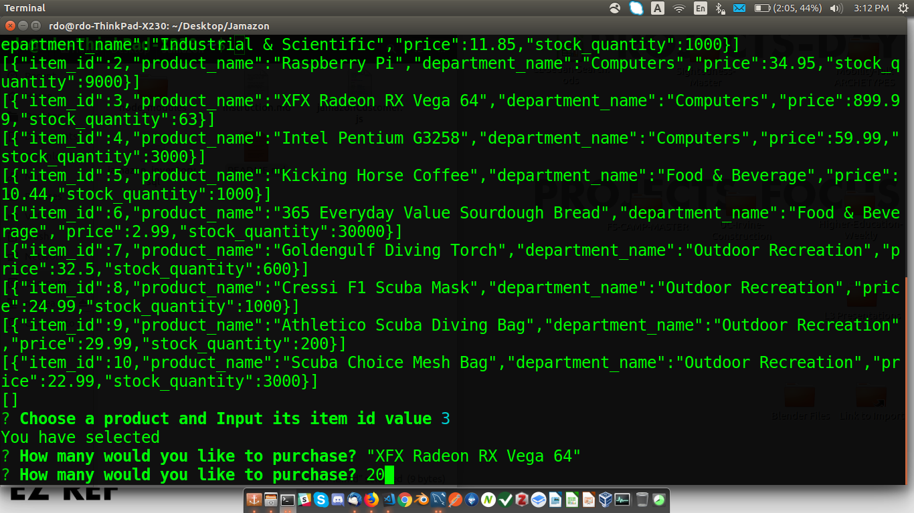
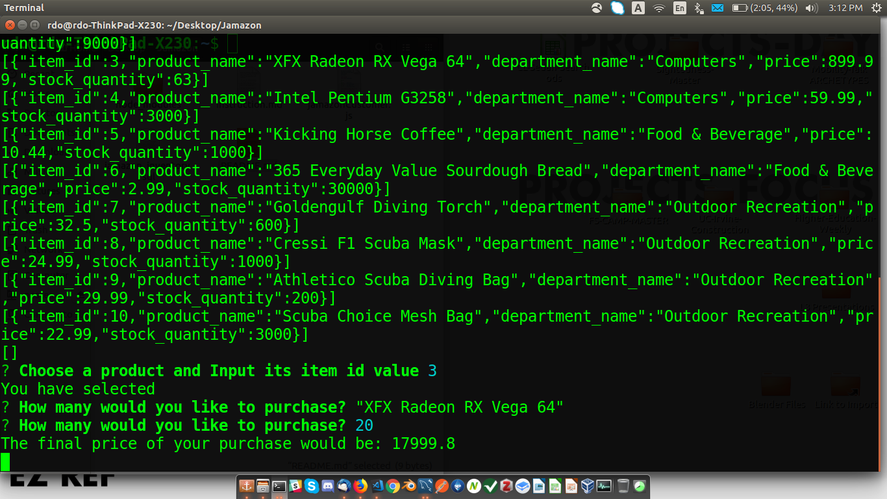

# Jamazon

The jamazon store only has 10 products and anything that goes out of stock will never be replenished.
Purchasing something is a 2-step process. Just look at the complete list of items and select an ID(1-10). Then input a desired quantity for said item. The final price will be printed if enough of this product is in stock. If not, a message should print informing you of insufficient stock. Upon rerun, the store's new quantity should be updated.

user selects desired product by id

user inputs desired quantity of product 

invoice printout

the quantity of the product has been updated
